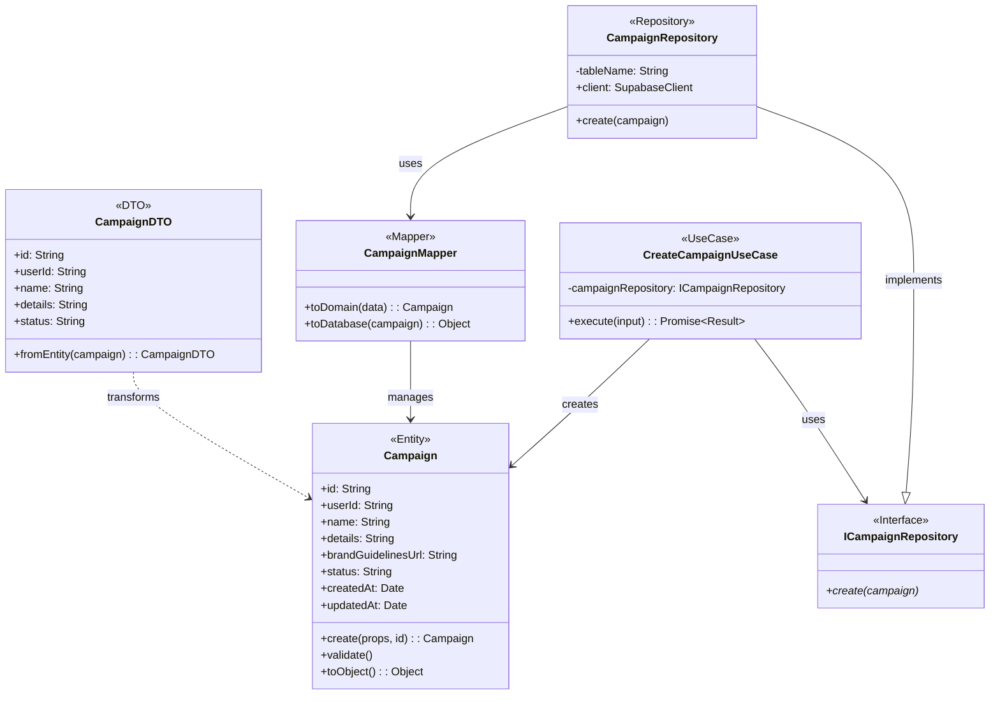

# Biểu đồ lớp cho chức năng Tạo chiến dịch

Tài liệu này chứa biểu đồ lớp cho chức năng tạo chiến dịch trong Catwalk Studio.

## Biểu đồ lớp (Class Diagram)

## Mô tả các lớp

1.  **Campaign (Domain Entity)**: Thực thể đại diện cho một chiến dịch, chứa các thuộc tính cơ bản và logic kiểm tra tính hợp lệ (validation).
2.  **CampaignDTO (Data Transfer Object)**: Đối tượng dùng để chuyển dữ liệu về phía giao diện (UI).
3.  **ICampaignRepository**: Interface định nghĩa phương thức lưu trữ chiến dịch.
4.  **CampaignRepository**: Lớp thực thi (implementation) cụ thể sử dụng Supabase để lưu chiến dịch vào bảng `campaigns`.
5.  **CampaignMapper**: Chuyển đổi dữ liệu giữa định dạng database và thực thể domain.
6.  **CreateCampaignUseCase**: Chứa logic nghiệp vụ xử lý việc tạo chiến dịch mới.
