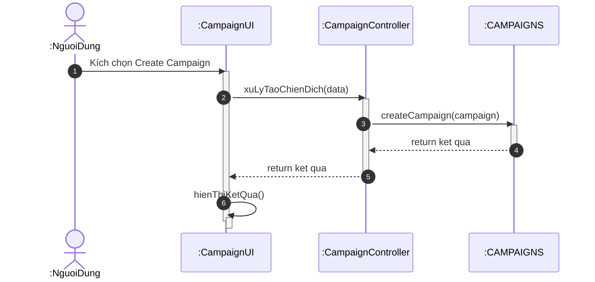

# Biểu đồ trình tự cho chức năng Tạo chiến dịch

Tài liệu này chứa biểu đồ trình tự mô tả luồng xử lý khi người dùng tạo một chiến dịch mới trong Catwalk Studio.

## Biểu đồ trình tự (Sequence Diagram)

## Giải thích luồng xử lý

1.  **Người dùng** tương tác với giao diện và nhấn nút để tạo chiến dịch mới.
2.  **CampaignUI** thu thập dữ liệu và gọi phương thức xử lý tại **CampaignController**.
3.  **CampaignController** thực hiện các logic nghiệp vụ và gọi **CAMPAIGNS (Repository)** để lưu dữ liệu vào hệ thống.
4.  Sau khi dữ liệu được lưu thành công, kết quả được trả ngược về cho giao diện.
5.  **CampaignUI** thực hiện việc hiển thị kết quả hoặc điều hướng người dùng đến trang chi tiết chiến dịch.
