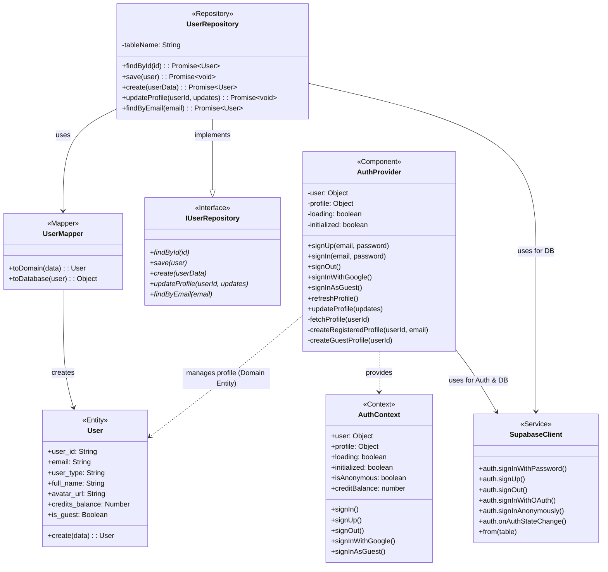

# Class Diagram for Login Functionality

This document contains the class diagram for the authentication and login system of Catwalk Studio, modeled using Mermaid.

## Overview

The login system is built around React Context for state management and Supabase for backend authentication and data persistence.

## Key Components

1.  **AuthProvider**: The main React component that manages the authentication state. It listens to Supabase auth events and synchronizes the user profile from the database.
2.  **AuthContext**: Provides the authentication state and methods to the rest of the application via the `useAuth` hook.
3.  **SupabaseClient**: The external service interface used for both authentication (OAuth, Email/Password, Anonymous) and database operations.
4.  **UserRepository**: Encapsulates the logic for accessing user profile data in the Supabase `users` table.
5.  **User (Domain Entity)**: Represents the user within the application's domain logic, ensuring data consistency and validation.
6.  **UserMapper**: Handles the conversion between the database representation (JSON/Table row) and the domain representation (User class).
