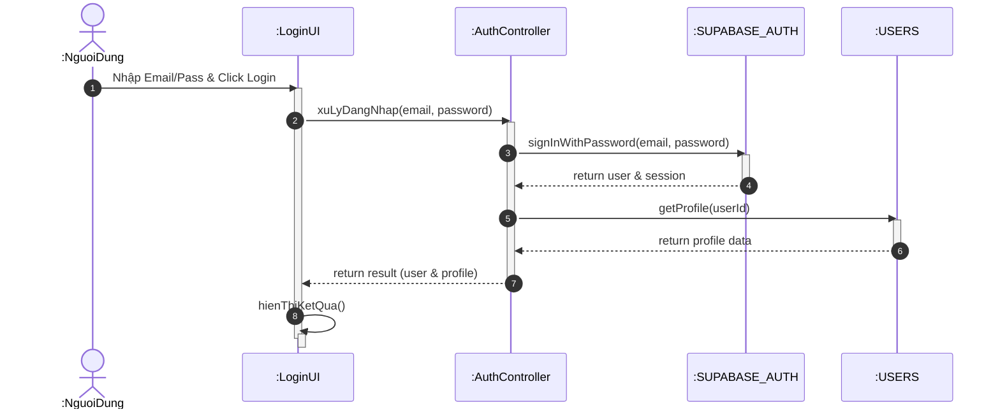

# Biểu đồ trình tự cho chức năng Đăng nhập

Tài liệu này chứa biểu đồ trình tự mô tả luồng xác thực người dùng trong Catwalk Studio.

## Biểu đồ trình tự (Sequence Diagram)

## Giải thích luồng xử lý

1.  **Người dùng** nhập thông tin đăng nhập vào form và nhấn nút Đăng nhập.
2.  **LoginUI** gọi hàm xử lý tại **AuthController** (trong dự án là `AuthContext`).
3.  **AuthController** gọi dịch vụ **Supabase Auth** để xác thực thông tin người dùng.
4.  Sau khi đăng nhập thành công, **AuthController** tiếp tục gọi đến bảng **USERS** để lấy thông tin hồ sơ (profile) chi tiết của người dùng đó.
5.  Kết quả (bao gồm thông tin định danh và hồ sơ) được trả về cho giao diện.
6.  **LoginUI** cập nhật trạng thái ứng dụng và hiển thị thông báo thành công hoặc điều hướng người dùng vào trang chính.
